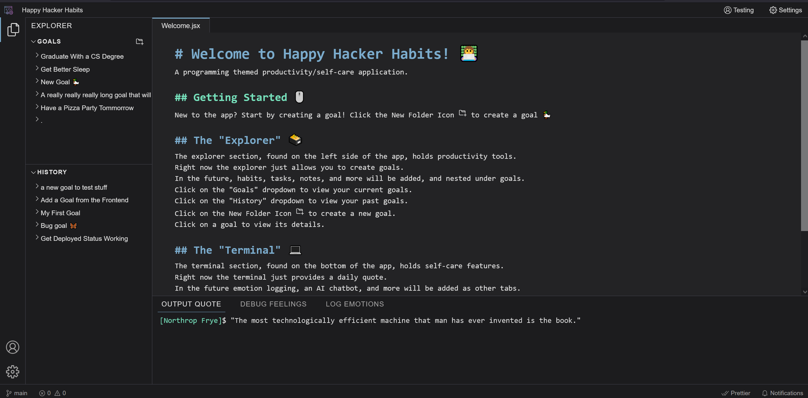

# Happy Hacker Habits 👩‍💻
Happy Hacker Habits is a programming themed habit-tracker/self-care app. Taking inspiration from an IDE, Happy Hacker uses the idea of committing tasks and deploying goals to motivate programmers to take care of their mental health. Happy Hacker comes with other 'extensions' and 'terminal' features like a daily quote and an AI chat bot. 


## Table of Contents 🗃️
- [Project Origin](#project-origin)
- [Project Demo](#project-demo)
- [Directory Structure](#directory-structure)
- [Setup and Deployment](#setup-and-deployment)
- [License](#license)
- [Acknowledgements](#acknowledgements)


## Project Origin 🖊️
This project was started as a final project for a web development course. 
[View our project proposal here.](https://docs.google.com/document/d/1OYjdzDZvDSURJe2Cz1CSXcOTVdVYTclTWXIsI5yY7no/edit?usp=sharing)


## Project Demo 🦆
Try out Happy Hacker at [https://happyhackerhabits.onrender.com/](https://happyhackerhabits.onrender.com/)


## Directory Structure 📁
``` BASH
. 
├── backend      # a node.js express application tier and a PostgreSQL data tier managed by Prisma ORM
└── frontend     # react app presentation tier
```


## Setup and Deployment ⌨️
The Back and Front end of the application are decoupled, and message each other using RESTful APIs.
Both need to be running for the app to function. 
- look at the `README.md` in the `backend` directory for steps on building and deploying the backend
- look at the `README.md` in the `frontend` directory for steps on building and deploying the frontend


## License 🖱️
This project is licensed under the MIT License - see the LICENSE.md file for details


## Acknowledgements 🖥️
- The project architecture was inspired by 
  [Taha's Code Camp's Habit Tracker](https://www.youtube.com/playlist?list=PLBrfwm2BeKHy7P8WINburW_2tdek9yCTx)
- The frontend design was inspired by [itsnitinr's vscode portfolio](https://github.com/itsnitinr/vscode-portfolio)


