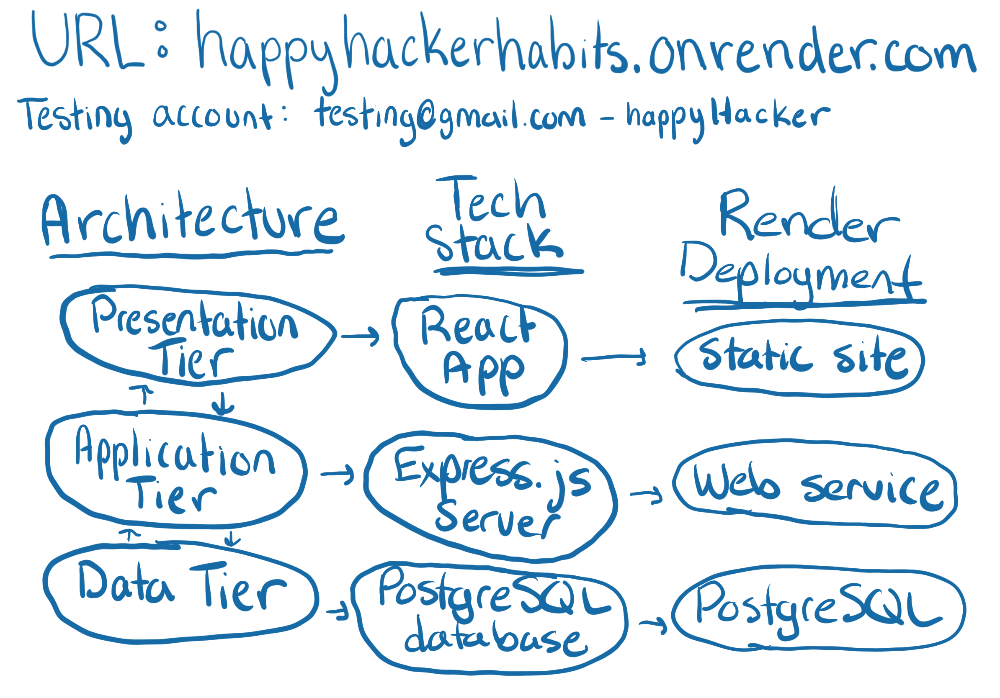
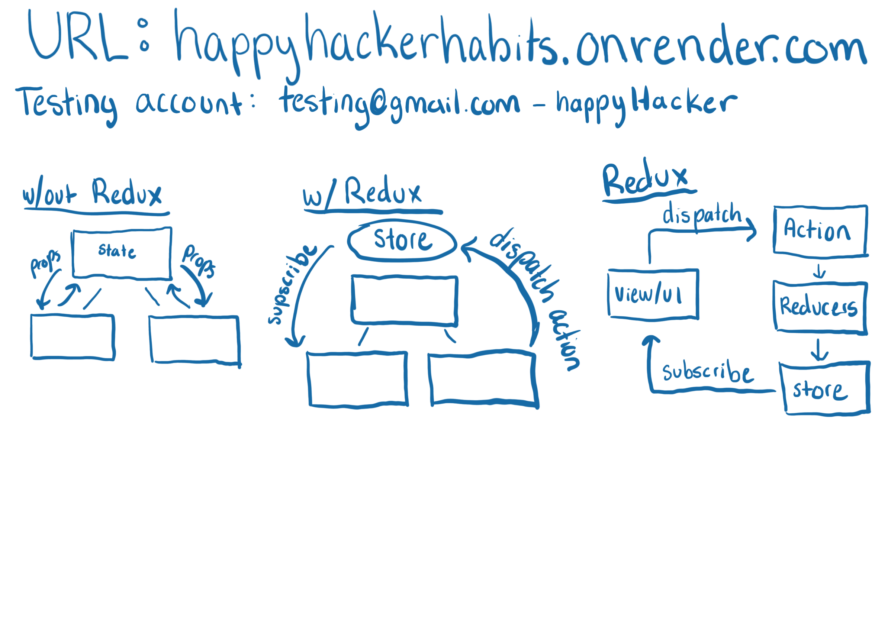

# Happy Hacker Habits Demo
demo/presentation for web development class.

## Intro - Render
- introduce self, that I will be explaining stuff, and that Syndee will be drawing 
  useful stuff that I will talk about later on the board.
- If you don't want to listen to us talk: play around with the app on Render
  link: [https://happyhackerhabits.onrender.com](https://happyhackerhabits.onrender.com)
- OR look though our code. Click the "main" button on the bottom bar to see our repository. 
  it also has this presentation's outline if you want words to look at while we talk 

## Notes about using the App - Render
few things to note about the MVP on Render:
- Security worries: 
  can delete your account OR 
  use our testing account (email: testing@gmail.com, password: happyHacker).
- **WILL NOT** look good on mobile. Didn't have time to make it mobile friendly. Use a laptop. 
- Did not have time to implement refresh tokens. So, if you refresh, you will need to re-login. You have been warned.

## Why We Made Happy Hacker / Why the user should use Happy Hacker - Render
- the idea behind happy hacker habits came from looking for a good habit tracker over the break and not 
  finding any good free options
- I had used Finch before which was nice because it had all the self care features I could want. but I 
  was not totally into the "taking care of a finch" motivation / theme 
- happy hacker habits is an all in one self care app that has a programming theme and motivate by the idea of deploying 
  your goals! It is styled to look like a IDE as it has all the self care tools you could want to improve your mental health
- So, if the first thing you think when you see the app is "that looks like VS code" then we succeeded :) 
- As we go though the demo you will notice that there aren't any habits yet. habits ended up being a bit more
  complicated then they were worth: we wanted to focus more on presentation then application logic. 
  So we opted to just add goals, which were easier to implement, and polish that styling. 

## How to use Happy Hacker / DEMO - Render
- start by showing off creating an account, the error checking, and error messages 
- then show the new account message, show logging in, and the error message
- then show the dropdown, profile page, where you can log out and delete the account, then delete it
- log into the demo account, show off the explorer component, which shows the goals for this presentation 
- point out the tab changing with each page

- show creating a new goal: "Have a Pizza Party After This"
- show looking at an existing goal, then how you can edit
- cancel editing the first time, then go back and actually edit
- deploy goals that have actually been completed
- show off the history section
- show un-deploying one of the goals
- create a goal "delete me" then delete it
- thats pretty much it for goals! 
- As you can see the explorer and editor components are focused more on productivity
  and goal accomplishment. In the future we would add the ability to create things underneath goals, like tasks, habits or notes. 
  maybe even sub-goals. 
- Goals end up being analogous to folders in a file system, and tasks/habits become files of different types

- show off the terminal, and daily quotes
- As you can see the terminal is more focused on self-care / emotional wellbeing, leading to a logical 
  grouping of features! 
- In the future AI chat and emotion logging could be added here

- thats about it for the app!

## Tech Stack / Architecture / Repository Organization -  Repo
- Happy Hacker is a full stack application with a backend server and a database
- we used the three tier architecture (explain what that is)
- the presentation tier talks to the application their via RESTful APIs
- the application tier talks to the data tier using Prisma ORM to build queries 

- we used the PERN tech stack. PostgreSQL as our data tier. 
  Express.js server running on Node.js as our application tier.
  React app running on Node.js as our presentation tier. 

- the application tier and data tier logic lives in the backend directory of the repo
- the presentation tier lives in the frontend directory of the repo
- all information about how to run the application or how the directory is structured lives
  in the READMEs inside those directories. 

## Pause for Questions? - Repo
- I will keep talking if nobody has anything specific they want me to talk about
  but I want to talk about what people are most interested about
  

## (IF TIME) Redux State Management Library - Repo Frontend
- there are two libraries I want to talk about one that helped with the frontend and one that 
  helped with the backend
- starting with frontend. We used the Redux state management library to help manage 
  the more complex state of our application

- If you all have been using react, or paying attention in class. with React's useState, 
  if two components want to manipulate a shared piece of state, that state needs to be defined in a parent 
  component and passed down as props. Which is fine if the two components share a direct parent and 
  the app is relatively simple. but can lead to a huge chain of prop passing if the application grows and many components 
  need that state. (for example when almost all components need user state information)
- Redux makes this state management simpler with the context of a store, actions, and reducers 
- instead of defining state in a parent component. you define the state as a slice in the store. Components can then subscribe to and 
  get state directly from the store, and not as props from a parent. 
- when a component wants to change the state, they dispatch an action (which defines how the state should be modified)
  that action will then cause a reducer to modify the state. the reducer uses information from the action to change the state
  of the store. All components that have subscribed to that piece of state will then get the updated state information

- Not all our state needs to use Redux, for example the quote state only lives in the terminal component 
  since it doesn't need to be shared between components
- one of the other cool things about redux is it isn't dependent on React, it can be used with any 
  javascript variation: angular, typescript, etc.

- Redux made managing our user and goal state SUPER easy. We are glad we used it. 
- show where our state stuff lives: the store, the user actions, and the user reducers

## (IF TIME) Prisma ORM Library - Repo Backend
- prisma is an ORM library for javascript/typescript (so also works for lots of different javascript flavors)
- ORM stands for Object–relational mapping, and allows easy conversion of data from a relational database
  into an object for use in object oriented programming. Or vise versa. 

- Prisma allows you to create models, which defines the data and relations inside your table. (show our model)
- Those module can then be used to generate a prima client which can be used to query against your database (show queries)
- the queries use the same logic of SQL (select, where, limit) but are more readable
- the queries use Prepared statements which protect against some injection attacks
- the modules can also be used to migrate the module to a database and synch the database with the module 
- you can also use Prisma to generate modules from an existing database

- all this makes it super easy to update the database if your schema needs to change, or to later
  move to a different SQL database as prisma supports many different types of SQL databases (even has mongo DB support)
- the queries and models would only need to change slightly to switch databases 

- Prisma made working with out database really easy and I am super glad that I used it to work with our data tier 

## (IF TIME) How we deployed on render - Repo 
each tier is deployed separately:
- postgreSQL database 
- webservice 
- website 

- which theoretically allows all tiers to scale and be developed independently 
- all available with free tier, but wont scale well and the database gets deleted in 90 days unless it gets upgraded 
- so super great for development but not great for production

## (IF TIME) Acknowledgements to resources we used + what we learned - Repo 
- how the playlist helped us research how to design the architecture and how pieces could talk to each other
- how the portfolio made designing the frontend much easier and provided a much of useful Icons (thanks so much 
  Ethan for sending it our way)

- learnings here: don't try to reinvent the wheel. Always good to look and see if someone else has solved a problem 
  like yours before and if you can use parts of that solution

## (IF TIME) What we would do if we had more time - Repo 
- show of the devnotes, and all the cool stuff we could add and fix if we had more time 
- deploying on AWS 
- UI features
- mobile friendless 